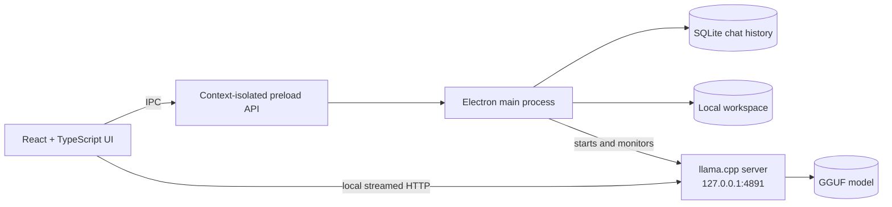

<div align="center">
  

  # LanternLM™

  **Private, portable AI that runs on your computer.**

  Run compatible GGUF language models locally through a polished Windows desktop application.

  [](#privacy-by-design)
  [](#requirements)
  [](https://www.typescriptlang.org/)
  [](LICENSE)

  **No cloud API · No telemetry · User-owned models and data**

  [Features](#features) · [Architecture](#architecture) · [Quick start](#quick-start) · [Development](#development) · [License](#license-and-attribution)
</div>

---

## About

LanternLM is an offline-first desktop client for local language models. It
starts a bundled [llama.cpp](https://github.com/ggml-org/llama.cpp) server on
your machine, discovers compatible `.gguf` models, streams generated responses,
and stores conversations locally in SQLite.

The project was built to explore a simple idea: a useful AI assistant should
still work when the internet does not—and private prompts should not need to
leave the device.

> [!NOTE]
> This repository contains the application source. Model weights and llama.cpp
> binaries are installed separately because they are large third-party
> artifacts with their own licenses.

## Features

| | Capability | What it provides |
|---|---|---|
| 🔒 | **Offline inference** | Prompts and responses stay on the local machine. |
| 🧠 | **Model discovery** | Detects compatible GGUF models placed in the models directory. |
| ⚡ | **Streaming chat** | Displays tokens while llama.cpp generates a response. |
| 💾 | **Persistent history** | Stores conversations locally with SQLite. |
| 📁 | **File workspace** | Imports, organizes, previews, renames, and exports local files. |
| 🖥️ | **Desktop experience** | Packages the React interface as a native Windows application with Electron. |

## Architecture



The Electron main process owns filesystem and database access. The renderer is
context-isolated and reaches those capabilities through a narrow preload API.
Inference is served locally through llama.cpp's OpenAI-compatible endpoint.

## Technology

| Layer | Technologies |
|---|---|
| Interface | React 19, TypeScript, CSS |
| Desktop runtime | Electron |
| Local inference | llama.cpp, GGUF |
| Persistence | SQLite, better-sqlite3 |
| Tooling | Vite, ESLint, Electron Builder |

## Requirements

- Windows 10 or newer
- Node.js 20 or newer
- A Windows llama.cpp release containing `llama-server.exe`
- At least one compatible GGUF instruct model
- Sufficient RAM for the selected model and context size

> [!TIP]
> Quantized models generally require less memory. Review the model card and
> license before downloading or redistributing any model.

## Quick start

### 1. Clone and install

```powershell
git clone https://github.com/faheem-shah-umer/LanternLM.git
cd LanternLM
npm install
```

### 2. Add the llama.cpp runtime

Download a Windows llama.cpp release and copy `llama-server.exe` together with
the DLL files from that same release into:

```text
portable/bin/
```

### 3. Add a model

Download a compatible `.gguf` instruct model—for example, from Hugging Face—and
place it in:

```text
portable/models/
```

Models are discovered automatically when LanternLM starts. They are excluded
from Git and are never uploaded by this project.

### 4. Run LanternLM

```powershell
npm run dev
```

Select a discovered model, choose **Load**, and start a conversation.

## Repository layout

```text
LanternLM/
├── electron/                 # Main process and context-isolated preload API
├── public/                   # Application branding
├── src/                      # React interface and file workspace
├── portable/
│   ├── bin/                  # Local llama.cpp runtime (not committed)
│   ├── models/               # Local GGUF models (not committed)
│   ├── workspaces/           # User files and SQLite history (not committed)
│   └── exports/              # Exported files (not committed)
├── package.json
└── README.md
```

## Development

| Command | Purpose |
|---|---|
| `npm run dev` | Start Vite and Electron in development mode |
| `npm run lint` | Check the TypeScript and React source |
| `npm run typecheck` | Type-check the renderer and Electron processes |
| `npm run build` | Create a production application build |
| `npm run check` | Run linting, type-checking, and the production build |
| `npm run dist` | Build a Windows installer in `release/` |

## Privacy by design

- Inference runs against a server bound to `127.0.0.1`.
- LanternLM does not require a cloud API key.
- Conversation history is stored in a local SQLite database.
- Models, workspace files, exports, and chat databases are excluded from Git.
- The application does not include telemetry.

LanternLM cannot make guarantees about separately downloaded models or runtime
binaries. Obtain them from sources you trust and review their licenses.

## Current scope

LanternLM is a portfolio release focused on Windows and local llama.cpp
inference. Performance and output quality depend on the chosen model and host
hardware. Generated responses can be inaccurate and should be verified when
used for important decisions.

## Roadmap

- [ ] Guided runtime and model setup
- [ ] Configurable context size and generation parameters
- [ ] Markdown and syntax-highlighted responses
- [ ] Model loading and generation diagnostics
- [ ] Automated tests for path handling and persistence

## Contributing

Issues and focused pull requests are welcome. Before submitting a change, run:

```powershell
npm run check
```

Do not commit model weights, runtime binaries, chat databases, workspace files,
or generated installers.

## License and attribution

Copyright © 2026 **Faheem Shah Umer Vattam Kandathil**.

The source code is available under the [MIT License](LICENSE). LanternLM™ is an
unregistered project mark used by Faheem Shah Umer Vattam Kandathil. See the
[project notice](NOTICE.md) and [third-party notices](THIRD_PARTY_NOTICES.md)
for additional attribution.

<div align="center">
  <sub>Built for private, local and portable AI.</sub>
</div>
